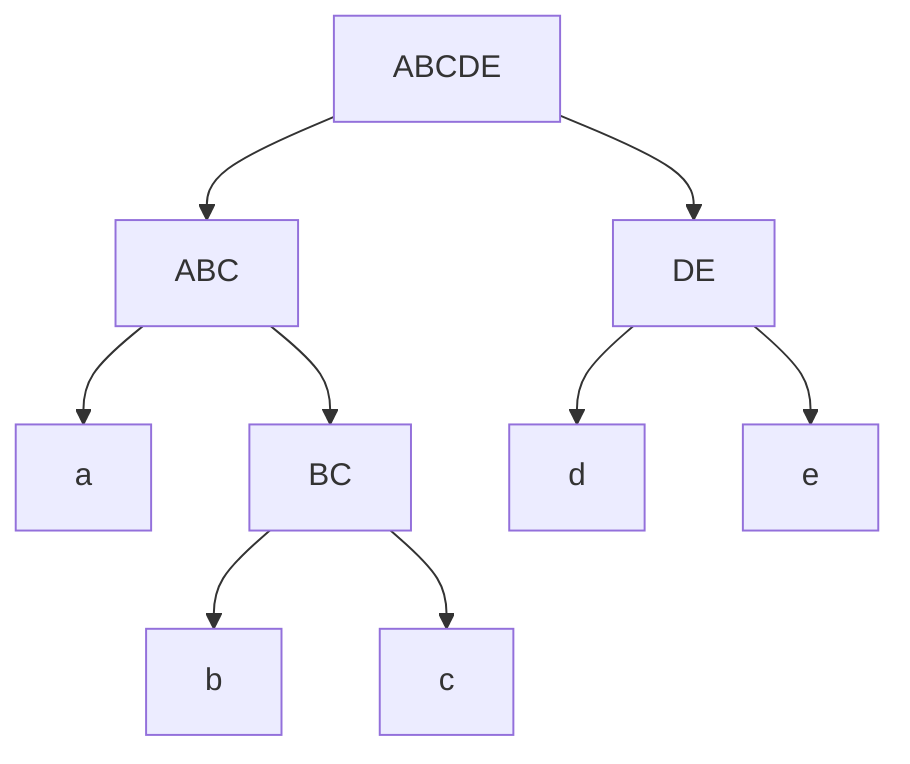
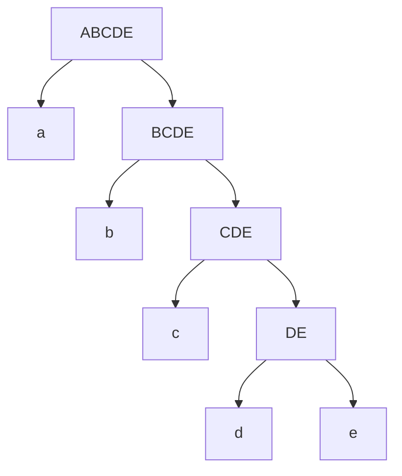

# Übung 7

## Aufgabe 12:

Bei einer gedächnislosen binären Quelle ist die Entropie dieser gegeben als:

$$
H(X) = -p \log_2 (p) - (1-p)\log_2(1-p)
$$

Algemein ist die Entropie einer Quelle:

$$
H(X) = - \sum_{i=1}^M p(x_i)\cdot \log_2(p(x_i))
$$

Für eine Quelle $\alpha = \{a, b\}$ mit Wahrscheinlichkeiten $\{p_a=0.85, p_b=0.15\}$ ist die Entropie $H(X_1) = -0.85\log_2(0.85) - 0.15\log(0.15) \approx 0.60984$ und nach der Zusammenfassung zu Blöcken $\{aa, ab, ba, bb \}$ mit $\{p_{aa}=p_a\cdot p_a=0.7225,p_{ab}=p_a \cdot p_b = 0.1275,p_{ba}=p_b \cdot p_a = 0.1275,p_{bb}=p_b \cdot p_b =0.0225,\} $ ist $H(X_2) = -0.7225 \log_2(0.7225) - 2(\cdot 0.1275 \log_2(0.1275)) - 0.0225\log_2(0.0225) \approx $1.21968

Da in $X_2$ die doppelte Anzahl an symbolen pro Zeichen wie in $X_1$ vorhanden sind, ist auch die Entropie doppelt so groß $H(X_1) = \frac{1}{2}H(X_2)$.

## Aufgabe 13:

Für die mittlere Codewortlänge $l_C$ gilt:

$$
l_C = \sum_{i=1}^M l_i \cdot p(x_i)
$$

Darüber wird die Redundanz definiert als:

$$
RC(X) = l_C - H(X)
$$

### Teil A) Huffman Code

Die Quelle sendet die Zeichen $\alpha = \{a, b, c, d, e\}$

#### 1.

Die Wahrscheinlichkeitsverteilung ist $\forall i: p(x_i) = \frac{1}{5}$

| Wort | Code  | $l_i$ |
| ---- | ----- | ----- |
| $a$  | $00$  | $2$   |
| $b$  | $010$ | $3$   |
| $c$  | $011$ | $3$   |
| $d$  | $10$  | $2$   |
| $e$  | $11$  | $2$   |

Mit der obigen Formel für die Mittlere Codelänge ist $l_C = \frac{12}{5}$ und die Entropie $H(X) = -\log_2(\frac{1}{5})$ wodurch die Redundanz $RC = \frac{12}{5} + \log_2(\frac{1}{5}) \approx 0.07807[bit]$ ist.

### 2.

Die Wahrscheinlichkeitsverteilung ist $\{p_a=\frac{1}{2}, p_b=\frac{1}{4}, p_c=\frac{1}{8}, p_d=\frac{1}{16}, p_e=\frac{1}{16}\}$

| Wort | Code   | $l_i$ |
| ---- | ------ | ----- |
| $a$  | $0$    | $1$   |
| $b$  | $10$   | $2$   |
| $c$  | $110$  | $3$   |
| $d$  | $1110$ | $4$   |
| $e$  | $1111$ | $4$   |

Mit der obigen Formel für die Mittlere Codelänge ist $l_C = \frac{1}{2}+\frac{2}{4}+\frac{3}{8} + \frac{4}{16} + \frac{4}{16} = \frac{15}{8} = 1.875$ und die Entropie $H(X) = -\frac{1}{2}\log_2(\frac{1}{2})-\frac{1}{4}\log_2(\frac{1}{4})-\frac{1}{8}\log_2(\frac{1}{8})-\frac{1}{16}\log_2(\frac{1}{16})-\frac{1}{16}\log_2(\frac{1}{16}) = 1.625$ wodurch die Redundanz $RC = 1.875 - 1.625 = 0.25[bit]$ ist.

### 3.

Die Wahrscheinlichkeitsverteilung ist $\{p_a=0.4, p_b=0.3, p_c=0.2, p_d=0.05, p_e=0.05\}$

| Wort | Code   | $l_i$ |
| ---- | ------ | ----- |
| $a$  | $0$    | $1$   |
| $b$  | $10$   | $2$   |
| $c$  | $110$  | $3$   |
| $d$  | $1110$ | $4$   |
| $e$  | $1111$ | $4$   |

Mit der obigen Formel für die Mittlere Codelänge ist $l_C = 1\cdot 0.4+2\cdot 0.3+3\cdot 0.2 + 4 \cdot 0.05 + 4 \cdot 0.05 = 2$ und die Entropie $H(X) = -0.4\log_2(0.4)-0.3\log_2(0.3)-0.2\log_2(0.2)-0.05\log_2(0.05)-0.05\log_2(0.05) \approx 1.73034$ wodurch die Redundanz $RC \approx 2 - 1.73034 = 0.26966[bit]$ ist.

### Teil B) Fano Code

Die Quelle sendet die Zeichen $\alpha = \{a, b, c, d, e\}$

### 1.

Die Wahrscheinlichkeitsverteilung ist $\forall i: p(x_i) = \frac{1}{5}$

Die Aufteilung in die einzelnen Mengen ergibt sich wie folgt:

1. $\{\frac{1}{5},\frac{1}{5},\frac{1}{5},\frac{1}{5},\frac{1}{5} \}$

2. $\{\frac{1}{5},\frac{1}{5},\frac{1}{5}\},\{\frac{1}{5},\frac{1}{5} \}$

3. $\{\frac{1}{5}\}\{\frac{1}{5},\frac{1}{5}\},\{\frac{1}{5}\},\{\frac{1}{5} \}$

4. $\{\frac{1}{5}\},\{\frac{1}{5}\},\{\frac{1}{5}\},\{\frac{1}{5}\},\{\frac{1}{5}\}$

Der dadurch aufgespannte Baum ist identisch zu dem aus **Aufgabe 13 Teil A) 1.**  und somit sind auch alle folgenden Rechnungen identisch und die Redundanz damit $RC \approx 0.07807[bit] $

### 2.

Die Wahrscheinlichkeitsverteilung ist $\{p_a=\frac{1}{2}, p_b=\frac{1}{4}, p_c=\frac{1}{8}, p_d=\frac{1}{16}, p_e=\frac{1}{16}\}$

Die Aufteilung der einzelnen Mengen ergibt sich wie folgt:

1. $\{\frac{1}{2}, \frac{1}{4}, \frac{1}{8}, \frac{1}{16}, \frac{1}{16}\}$

2. $\{\frac{1}{2}\}, \{\frac{1}{4}, \frac{1}{8}, \frac{1}{16}, \frac{1}{16}\}$

3. $\{\frac{1}{2}\}, \{\frac{1}{4}\}, \{ \frac{1}{8}, \frac{1}{16}, \frac{1}{16}\}$

4. $\{\frac{1}{2}\}, \{\frac{1}{4}\}, \{ \frac{1}{8}\}, \{ \frac{1}{16}, \frac{1}{16}\}$

5. $\{\frac{1}{2}\}, \{\frac{1}{4}\}, \{ \frac{1}{8}\}, \{ \frac{1}{16}\}, \{\frac{1}{16}\}$

Der dadurch aufgespannte Baum ist identisch zu dem aus **Aufgabe 13 Teil A) 2.** und somit sind auch alle folgenden Rechnungen identisch und die Redundanz damit $RC = 0.25[bit]$

### 3.

Die Wahrscheinlichkeitsverteilung ist $\{p_a=0.4, p_b=0.3, p_c=0.2, p_d=0.05, p_e=0.05\}$

Die Aufteilung auf die einzelnen Mengen ergibt sich wie folgt:

1. $\{0.4, 0.3, 0.2, 0.05, 0.05\}$

2. $\{0.4\},\{0.3, 0.2, 0.05, 0.05\}$

3. $\{0.4\},\{0.3\},\{0.2, 0.05, 0.05\}$

4. $\{0.4\},\{0.3\},\{0.2\},\{ 0.05, 0.05\}$

5. $\{0.4\},\{0.3\},\{0.2\},\{ 0.05\},\{ 0.05\}$

Der dadurch aufgespannte Baum ist identisch zu dem aus **Aufgabe 13 Teil A) 3.** und somit sind auch alle folgenden Rechnungen identisch und die Redundanz damit $RC \approx 0.26966[bit]$
